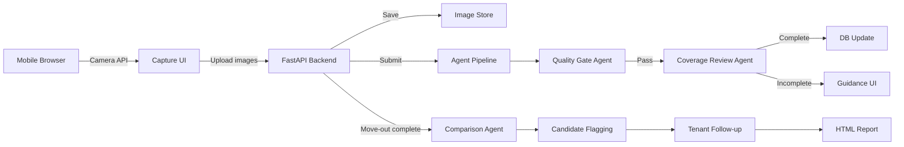
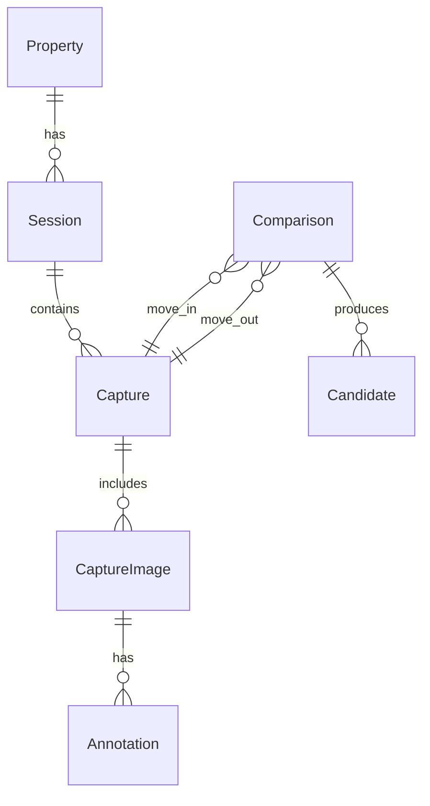

# Architecture

## System Overview

The Walkthrough Capture System is a dispute-friendly property documentation tool that uses AI-powered agents to ensure photo quality, coverage completeness, and move-in/move-out comparison.

## High-Level Data Flow

## Agent Architecture

```mermaid
graph TD
    subgraph "Quality Gate Agent"
        QG1[compute_metrics] --> QG2[evaluate]
        QG2 -->|clear pass/fail| QG3[finalize]
        QG2 -->|borderline| QG4[LLM judge]
        QG4 --> QG3
    end

    subgraph "Coverage Review Agent"
        CR1[summarize_all] --> CR2[aggregate]
        CR2 -->|complete| CR3[done]
        CR2 -->|incomplete| CR4[generate_instructions]
    end

    subgraph "Comparison Agent"
        CP1[pair_images] --> CP2[normalize]
        CP2 --> CP3[structural_diff]
        CP3 --> CP4[extract_regions]
        CP4 --> CP5[analyze_candidates]
        CP5 --> CP6[language_policy]
        CP6 --> CP7[compose_followups]
    end
```

## Technology Stack

| Layer | Technology |
|-------|-----------|
| Frontend | Plain HTML/CSS/JS (mobile-first) |
| Backend | FastAPI + Python 3.14 |
| Database | SQLite + SQLAlchemy (async) |
| Agents | LangGraph (StateGraph per agent) |
| Vision LLM | OpenAI GPT-4o (primary) + Anthropic Claude |
| Classical CV | OpenCV + Pillow |
| Real-time | WebSockets (native FastAPI) |
| IDs | ULID (sortable, URL-safe) |

## Data Model

## Request Flow

1. **Capture Flow**: User opens property → starts session → navigates to room → takes 8 guided photos → submits
2. **Agent Pipeline**: Quality Gate checks each image → Coverage Review checks completeness → guidance if needed
3. **Comparison Flow**: Move-out session auto-triggers comparison against move-in → candidates flagged → tenant responds
4. **Report**: HTML report generated with full audit trail, images, candidates, and tenant responses
